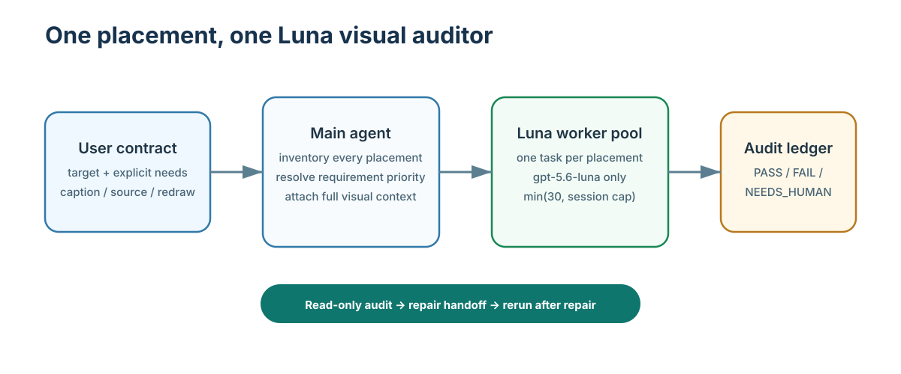
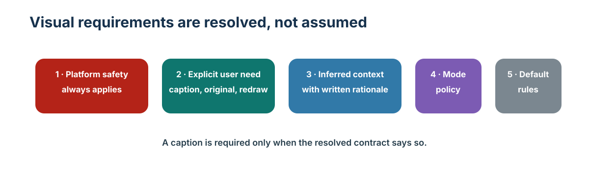
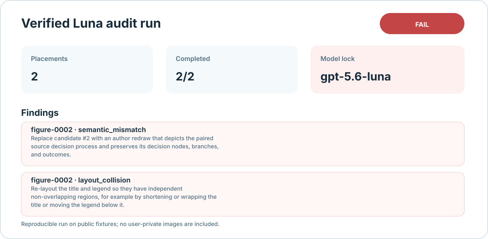
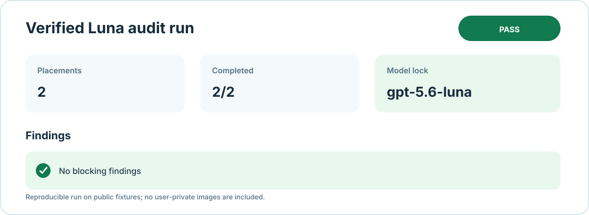

# Visual Inspection

**A read-only visual acceptance plugin for figures in papers, reports, and technical documents.**

[简体中文](README.zh-CN.md) · [PRD](docs/PRD.md) · [System design](docs/SYSTEM_DESIGN.md) · [Test results](docs/TEST_RESULTS.md) · [Contributing](CONTRIBUTING.md)

`Visual Inspection` inventories every logical figure placement, gives each placement to one narrowly scoped `gpt-5.6-luna` visual auditor, and returns a traceable audit ledger plus repair handoff. It does not alter your figures or report files. Version 0.2.0 also compares figure metrics/trends with captions and body text, requests high-resolution evidence, records precise issue regions, and distinguishes explicit template exemptions from defects.



## Why it exists

A compiled PDF can still contain a broken figure:

- the crop removes the y-axis, model labels, legend, or required caption;
- the crop includes a page of irrelevant prose instead of the actual Figure;
- a redraw has overlapping title, legend, labels, or annotations;
- a claimed Chinese redraw is unrelated to the source figure;
- the same image appears in several locations, but only one placement was checked.

This plugin makes those placements explicit and refuses to report a complete `PASS` when coverage, evidence, model locking, or requirement resolution is incomplete.

## How it works

1. The Main agent discovers every logical placement in LaTeX, Markdown, a PDF, or an image directory.
2. It writes the resolved audit contract: explicit user requirements, documented inferences, defaults, and unresolved conflicts.
3. It dispatches one `gpt-5.6-luna` worker per placement, with complete page/asset/pair context and the versioned audit policy.
4. It validates structured results and writes `PASS`, `FAIL`, or `NEEDS_HUMAN`, together with a repair handoff.
5. A separate authoring workflow repairs failures and reruns the audit.



An explicit requirement such as “include the caption” or “keep the original Figure and add a separate Chinese redraw” applies only when the current user requests it or context unambiguously establishes it. It is not imposed on every project.

## A real regression: the “image fight”

The public fixtures below are entirely hand-drawn for this repository. They model a serious failure seen in report production: the source is a decision tree, while the alleged redraw is an unrelated bar chart with a title/legend collision.

<table>
  <tr><th>Source figure</th><th>Wrong claimed redraw</th></tr>
  <tr>
    <td></td>
    <td></td>
  </tr>
</table>

The verified Luna smoke test audited both placements. The intact source passed; the claimed redraw failed for `semantic_mismatch` and `layout_collision`.



The correct independent redraw preserves the source decision structure and passes the same workflow.

<table>
  <tr><th>Independent Chinese redraw</th><th>Verified passing audit</th></tr>
  <tr>
    <td></td>
    <td></td>
  </tr>
</table>

The cards are generated from real local smoke-test ledgers on public fixtures; they do not contain user-private images.

## Install

### From a local checkout

```sh
cd codex-visual-inspection
codex plugin marketplace add .
codex plugin add visual-inspection@visual-inspection
```

Restart the ChatGPT desktop app or begin a new Codex task after installation so the skill is loaded.

### From a published GitHub repository

This working tree deliberately has no fabricated GitHub owner or remote URL, so it does not advertise an install command that cannot work. After a maintainer assigns a real public repository and release branch, publish the exact Git Marketplace command in this section. The expected packaging route is documented in the [official Codex plugin guide](https://developers.openai.com/plugins/build/plugins).

## Use it in Codex

Ask for the skill directly, or describe the audit in natural language:

```text
$visual-inspection Inspect every figure in report/main.tex before publication, including figure-text consistency.
The full caption must be included whenever an original Figure is cropped.
For each original source screenshot, check the separate Chinese redraw too.
```

The Main agent will create a requirements record, discover figures, and dispatch Luna workers. The plugin's deterministic helper can also be used directly:

```sh
python3 plugins/visual-inspection/scripts/figure_acceptance.py discover \
  --target report/main.tex \
  --render-tex \
  --requirements-file requirements.json \
  --run-dir .visual-inspection/runs/release-audit

# After the Main agent has collected one Luna JSON result per task:
python3 plugins/visual-inspection/scripts/figure_acceptance.py validate \
  --run-dir .visual-inspection/runs/release-audit
```

An optional requirements file makes special expectations explicit:

```json
{
  "explicit": [
    {
      "id": "caption-required",
      "text": "The complete Figure 4 caption must be included in the accepted crop."
    }
  ],
  "inferred": [],
  "conflicts": []
}
```

## Output contract

Every run writes a separate `.visual-inspection/runs/<run-id>/` directory:

| File | Purpose |
| --- | --- |
| `figure_inventory.jsonl` | Every discovered logical figure placement. |
| `audit_tasks.jsonl` | One Luna task per placement, including effective requirements. |
| `resolved_requirements.json` | Explicit, inferred, default, and conflicting requirements. |
| `findings.jsonl` | One structured Luna result per task. |
| `summary.md` / `summary.json` | Overall status and coverage. |
| `coverage.json` | Missing tasks, invalid records, conflicts, and model violations. |
| `repair_handoff.md` | Concrete repairs for blocking findings. |

`PASS` means every discovered placement was audited with valid Luna results and no blocking issue. `FAIL` means a confirmed defect exists. `NEEDS_HUMAN` is used for missing evidence, requirement conflicts, unsafe/unavailable rendering, invalid results, or unavailable Luna; the plugin never silently substitutes another model.

## Supported inputs and safety boundary

| Input | Discovery | Visual context |
| --- | --- | --- |
| LaTeX | `\includegraphics`, figure blocks, captions, labels | Optional isolated XeLaTeX rendering with shell escape disabled |
| Markdown | Image references, nearby captions, optional role/pair markers | Asset plus available document context |
| PDF | Raster image objects plus one vector/page-coverage sentinel per page | Full page PNG evidence via `pdftoppm` |
| Image directory | Supported raster/SVG files | Each image asset |

The plugin is read-only with respect to inputs. It writes only a separate audit run and never uploads or commits the inspected figures. Native Codex workers still operate under the host environment's permissions and data policies; do not use sensitive material without reviewing those policies.

## Verify the project

```sh
python3 scripts/validate_package.py
python3 -m unittest discover -s tests -v
python3 /path/to/plugin-creator/scripts/validate_plugin.py plugins/visual-inspection
```

The deterministic suite covers discovery, requirements, model locking, JSON validation, coverage gates, input immutability, public fixtures, and PDF page candidates. The documented Luna smoke tests cover both a failing mismatch case and a clean passing pair.

## Contributing and license

Read [CONTRIBUTING.md](CONTRIBUTING.md) before adding a fixture or changing the auditor policy. Public fixtures must be hand-drawn, self-owned, or clearly redistributable; private report pages and user attachments are not accepted.

Licensed under [MIT](LICENSE).
