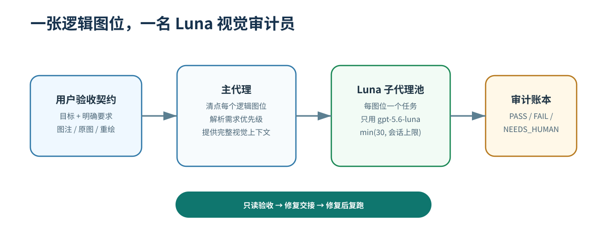
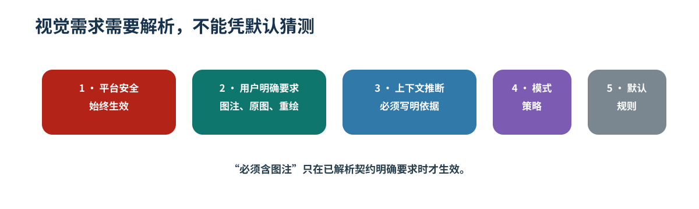
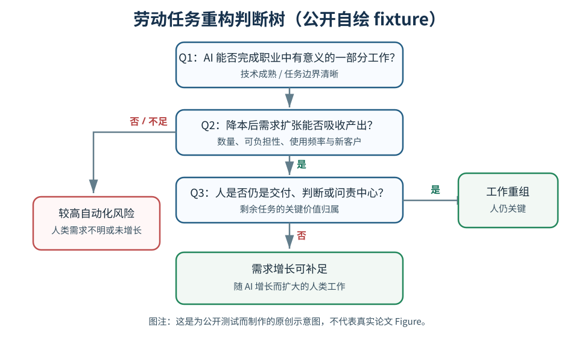
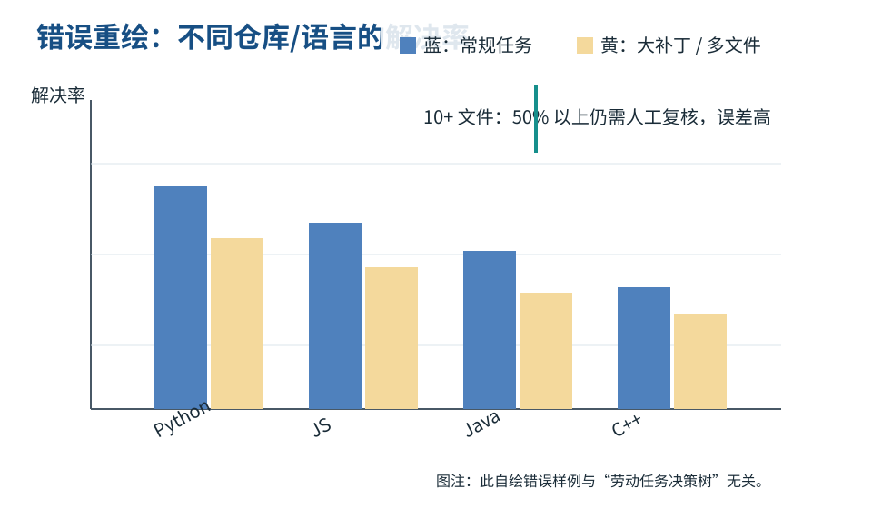
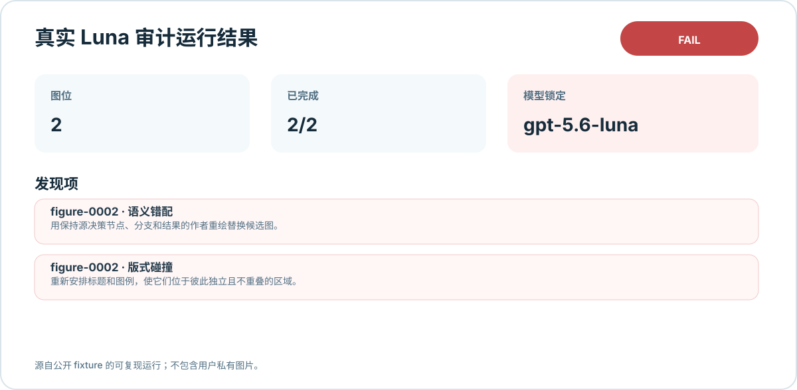
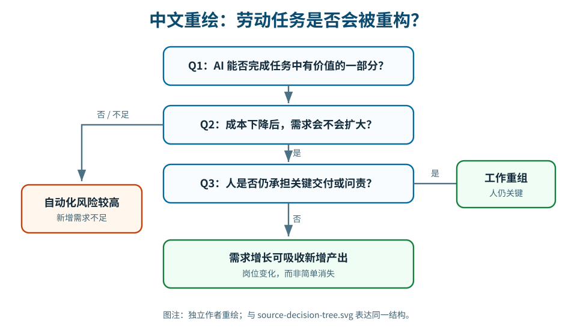
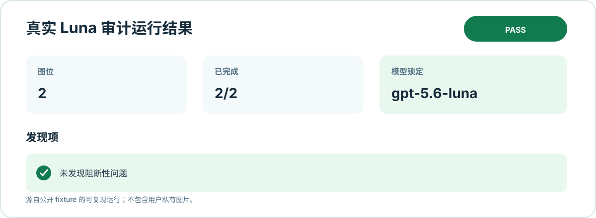

# Visual Inspection（视觉验收）

**面向论文、报告和技术文档图表的只读视觉验收 Codex 插件。**

[English](README.md) · [产品需求文档](docs/PRD.md) · [系统设计](docs/SYSTEM_DESIGN.md) · [测试结果](docs/TEST_RESULTS.md) · [贡献指南](CONTRIBUTING.md)

当前版本：`0.2.0` · 插件包：`visual-inspection` · Skill：`$visual-inspection` · [GitHub 仓库](https://github.com/Shiba-hua/codex-visual-inspection)

`Visual Inspection` 会清点文档中的每个逻辑图位，为每个图位派出一名范围严格限定的 `gpt-5.6-luna` 视觉审计子代理，并输出可追溯审计账本和修复交接。它不会修改你的图片、图注或报告源文件。0.2.0 还会在有文字上下文时核对图中指标/趋势与图注、正文，要求高清证据，记录精准问题区域，并区分明确模板豁免与真实缺陷。



## 它解决什么问题

PDF 能成功编译，并不代表图像已经合格。常见问题包括：

- 裁图切掉 y 轴、模型名、图例、关键标签、脚注或用户要求保留的图注；
- 截图混入大段无关英文正文，真正的 Figure 反而很小；
- 自绘图的标题、图例、标签、注释相撞、遮挡或溢出；
- 所谓“汉化重绘”与原图完全无关；
- 同一图片在正文和附录以不同方式排版，却只检查了一处。

本插件把这些图位显式登记，并在覆盖率、证据、模型锁定或需求解析不完整时拒绝报告整体 `PASS`。

## 0.2.0 新特性

0.2.0 保留原有图位发现、Luna 审计、只读边界和覆盖率门禁，并新增针对论文自动化写作、Codex 自动调研报告中常见错误的证据化检查：

| 能力 | 检查或记录的典型问题 |
| --- | --- |
| 图文指标一致性 | 图中写 `Final Validation Loss`，但图注或正文写成 `accuracy`。 |
| 图文趋势一致性 | 柱形/曲线实际上升，但文字描述为下降、平台期或没有改善。 |
| 图注/正文一致性 | 图、图注和邻近正文使用了不同结论或不同比较对象。 |
| 高清证据 | 证据模糊时不允许猜测，返回 `evidence_low_resolution` 并要求回溯高清资产。 |
| 精准问题区域 | 用户指定红框/问题区域时，将其作为主要证据，不把整页无关内容放入夹具。 |
| 源码残留 | 报告中出现 LaTeX 命令、源码标记、异常字形或命令片段时报告 `source_residue`。 |
| 明确豁免 | 清楚标记为模板上下文的占位符可用 `disposition: exempt` 记录，不导致整体失败。 |

图文矛盾类 finding 必须同时返回图像证据、文字证据和结构化 `contradiction`，明确说明图说了什么、文字说了什么、哪一维度发生冲突，以及应修复哪一侧。原有的裁断、过度截取、版式碰撞、可读性、语义错配、角色混淆、重复/错位和上下文缺失类别继续有效。

新增公开源工程夹具及其页码、裁剪信息和 SHA-256 记录在 [`fixtures/public/asset_provenance.json`](fixtures/public/asset_provenance.json)。这些资产直接从登记的 LaTeX/源工程复制，绝不从错误汇总 PDF 或用户附件截图。

## 工作方式

1. Main agent 从 LaTeX、Markdown、PDF 或图片目录中发现每个逻辑图位。
2. 它将用户明确要求、可解释的上下文推断、默认规则和未决冲突写入需求账本。
3. 它为每个图位分派一名 `gpt-5.6-luna`，并同时提供完整页面、候选图、图注、原图/重绘图等上下文。
4. 它验证结构化结果，输出 `PASS`、`FAIL` 或 `NEEDS_HUMAN`，并生成修复交接。
5. 上游写作/制图工作流完成修复后，再次运行验收。



例如“裁图必须包含图注”“原始 Figure 需额外给出独立汉化重绘”不是通用默认规则；只有用户当轮明确提出，或上下文有充分依据时才会生效。

## 真实回归样例：“图片打架”

下面的公开样例均为本仓库手工自绘。它模拟一个高风险错误：原图是决策树，所谓重绘却变成无关柱状图，而且标题与图例发生碰撞。

<table>
  <tr><th>原始决策树</th><th>错误声称的“重绘图”</th></tr>
  <tr>
    <td></td>
    <td></td>
  </tr>
</table>

真实 Luna 烟雾测试逐图位审计后，原决策树通过；错误重绘图因 `semantic_mismatch` 与 `layout_collision` 失败。



下面是与原图表达同一判断结构、且版式干净的独立中文重绘；它在同一流程中通过。

<table>
  <tr><th>正确的独立中文重绘</th><th>真实 Luna 通过结果</th></tr>
  <tr>
    <td></td>
    <td></td>
  </tr>
</table>

结果卡由真实本地 Luna 运行账本生成，只使用公开 fixture，不含用户私有图片。

## 安装

### 从本地工作副本安装

```sh
cd codex-visual-inspection
codex plugin marketplace add .
codex plugin add visual-inspection@visual-inspection
```

安装后请重启 ChatGPT 桌面端，或新建一个 Codex task，让插件 Skill 被重新加载。

### 从 GitHub 仓库安装

仓库为 [Shiba-hua/codex-visual-inspection](https://github.com/Shiba-hua/codex-visual-inspection)。先克隆，再从本地工作副本安装：

```sh
git clone https://github.com/Shiba-hua/codex-visual-inspection.git
cd codex-visual-inspection
codex plugin marketplace add .
codex plugin add visual-inspection@visual-inspection
```

打包与发布方式可参阅 [Codex 官方插件指南](https://developers.openai.com/plugins/build/plugins)。

## 在 Codex 中使用

可以直接调用 Skill，或用自然语言描述验收要求：

```text
$visual-inspection 在发布前检查 report/main.tex 中的每一张图，并核对图文一致性。
凡是原始 Figure 的裁图，必须完整包含图注。
每张原始截图都要检查对应的独立中文重绘图。
```

Main agent 会建立需求账本、发现图位、派出 Luna，并汇总审计。也可以直接使用确定性辅助脚本：

```sh
python3 plugins/visual-inspection/scripts/figure_acceptance.py discover \
  --target report/main.tex \
  --render-tex \
  --requirements-file requirements.json \
  --run-dir .visual-inspection/runs/release-audit

# Main agent 收齐每项 Luna JSON 结果后：
python3 plugins/visual-inspection/scripts/figure_acceptance.py validate \
  --run-dir .visual-inspection/runs/release-audit
```

可选的 `requirements.json` 用于记录特殊要求：

```json
{
  "explicit": [
    {
      "id": "caption-required",
      "text": "验收通过的裁图必须包含完整的 Figure 4 图注。"
    }
  ],
  "inferred": [],
  "conflicts": []
}
```

## 输出契约

每次运行均写入独立的 `.visual-inspection/runs/<run-id>/`：

| 文件 | 作用 |
| --- | --- |
| `figure_inventory.jsonl` | 每个已发现的逻辑图位。 |
| `audit_tasks.jsonl` | 每图位一项 Luna 任务及其有效要求。 |
| `resolved_requirements.json` | 明确、推断、默认和冲突要求。 |
| `findings.jsonl` | 每项任务的一条结构化 Luna 结果。 |
| `summary.md` / `summary.json` | 整体状态与覆盖率。 |
| `coverage.json` | 漏检任务、无效记录、冲突和模型违规。 |
| `repair_handoff.md` | 每个阻断问题的具体修复交接。 |

`PASS` 表示全部图位都已有合法 Luna 结果且无阻断问题；`FAIL` 表示已确认缺陷；`NEEDS_HUMAN` 表示证据不足、需求冲突、渲染不安全/不可用、结果无效或 Luna 不可用。插件不会悄悄改用其他模型。

## 输入范围与安全边界

| 输入 | 发现方式 | 视觉上下文 |
| --- | --- | --- |
| LaTeX | `\includegraphics`、图环境、图注、标签 | 可选隔离 XeLaTeX 渲染，禁用 shell escape |
| Markdown | 图片引用、邻近图注、可选角色/配对标记 | 图片本身与可得文档上下文 |
| PDF | 栅格图像对象，外加每页一个矢量/页面级覆盖哨兵 | `pdftoppm` 生成的完整页面证据 |
| 图片目录 | 支持的栅格/SVG 图片 | 每个图片资产 |

插件对输入保持只读，只在独立运行目录中写入审计产物，不上传或提交被检查的图片。原生 Codex 子代理仍受宿主环境权限与数据策略约束；涉及敏感材料时请先审阅这些策略。

## 验证项目

```sh
python3 scripts/validate_package.py
python3 -m unittest discover -s tests -v
python3 /path/to/plugin-creator/scripts/validate_plugin.py plugins/visual-inspection
```

确定性测试覆盖图位发现、需求继承、模型锁定、JSON 校验、覆盖率门禁、输入只读、公开 fixture、PDF 页面候选、图文证据要求、明确豁免以及资产来源/哈希校验。文档化的 Luna 烟雾测试同时覆盖错误错配样例和干净通过样例。

## 贡献与许可证

添加 fixture 或修改审计策略前请阅读 [CONTRIBUTING.md](CONTRIBUTING.md)。公开 fixture 必须是手工自绘、自有或明确可再发布的素材；不得提交私有报告页面和用户附件。

本项目采用 [MIT](LICENSE) 许可证。
