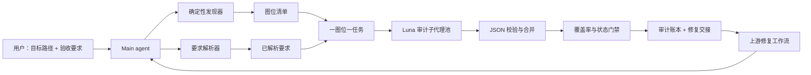

# 系统设计

## 1. 设计原则

- **全量覆盖优先于抽样。** 每个逻辑图位都要有终态。
- **视觉上下文优先于局部裁剪。** 审计者同时查看页面、候选图、图注和源定位。
- **用户要求优先。** 固定策略是底线，不覆盖本次任务的明确约束。
- **只读、可追溯、fail-closed。** 不修改输入；证据不足不通过。
- **一图位一 Luna。** 子代理任务窄、独立、可并行；Main agent 只做确定性汇总。

## 2. 架构



## 3. 输入处理

### 3.1 支持的目标

| 输入 | 发现策略 | 视觉上下文 |
| --- | --- | --- |
| `.tex` | 解析 `\\includegraphics`、图环境、图注和关联文件。 | 可选安全 XeLaTeX 渲染；失败则标记限制。 |
| `.md` | 解析 Markdown 图像链接与邻近说明。 | 资产本身与可得文本上下文。 |
| `.pdf` | `pdfimages -list` 识别栅格对象，并为每页增加矢量/页面级覆盖哨兵。 | `pdftoppm` 生成完整页面证据。 |
| 图片目录 | 枚举 PNG/JPEG/WebP/SVG。 | 每个资产本身。 |

逻辑图位不是单纯的文件名。例如同一 PNG 在正文和附录以不同裁剪方式出现时，形成两个独立图位。

### 3.2 已解析要求

`resolved_requirements.json` 包含：

- `explicit`：用户当轮原文或由 Main agent 逐条摘录的要求；
- `inferred`：从上下文推断的要求及依据；
- `defaults`：通用视觉验收规则；
- `conflicts`：无法自动判定的冲突；
- `effective`：分派给图位的最终要求集合。

## 4. 任务与子代理契约

每项任务包含：

```json
{
  "task_id": "figure-0001",
  "placement": {"source": "report/main.tex", "page": 3, "caption": "..."},
  "assets": [{"path": "figures/example.png", "sha256": "...", "role": "source_figure"}],
  "evidence": {"page_render": "evidence/pages/page-003.png"},
  "requirements": ["图注必须纳入截图"],
  "auditor_policy_version": "2.0.0",
  "required_model": "gpt-5.6-luna"
}
```

Main agent 必须为每个任务传递版本化审计指令包。该包要求子代理：

1. 不修改文件；
2. 先确认任务范围和用户特殊要求；
3. 检查裁断、过度截取、错配、碰撞、遮挡、可读性与角色一致性；
4. 区分“正式原图”“独立汉化/作者重绘”“未知角色”；
5. 不在证据不足时猜测；
6. 只返回符合 Schema 的 JSON。

当任务具备图注、正文、批注或上下文文字时，审计者还必须建立图像证据与文字证据双通道：分别提取指标、单位、趋势、比较对象和结论强度，并在 `contradiction` 中解释冲突。低清证据必须回溯高清源或转人工；用户指定红框时记录精准区域，同时保留完整页面作为上下文。

产品不能替换平台 system prompt，因此所谓“审计系统提示词”是随任务原样传递的版本化指令包；文档与账本必须明确这一点。

## 5. 调度与结果合并

- 并发槽数为 `min(30, agents.max_concurrent_threads_per_session)`；若系统未暴露该设置，Main agent 以会话实际允许值为上限。
- 每图位恰好一名 `gpt-5.6-luna` 子代理；不得用 Terra/Sol 作为降级模型。
- 任务 JSON 无效时，同一 Luna 任务重试一次；再次失败即 `NEEDS_HUMAN`。
- Main agent 校验每个 `task_id` 恰有一个终态、模型记录正确、状态合法、发现结构合法。
- 不使用多数投票掩盖单图缺陷。低证据、冲突或缺失上下文直接升级人工。

## 6. 错误分类

| 类别 | 含义 |
| --- | --- |
| `crop_truncation` | 轴、图例、标签、图注或所需脚注被切掉。 |
| `crop_excess` | 截入无关正文、页眉、页脚、表格或下一幅图。 |
| `layout_collision` | 标题、图例、标签、文本或图形重叠。 |
| `legibility` | 模糊、分辨率不足、缺字、字体不可读。 |
| `semantic_mismatch` | 图、图注、源图、重绘图或任务语义不一致。 |
| `role_confusion` | 原图、自绘、汉化图的角色误标或混淆。 |
| `duplicate_or_misaligned` | 重复图、错位图或不当复用。 |
| `missing_context` | 无法获得用户要求所需的页面/图注/来源证据。 |
| `figure_text_metric_mismatch` | 图中指标与图注/正文指标不同，例如 loss 与 accuracy 混用。 |
| `figure_text_trend_mismatch` | 图中趋势方向与正文/图注描述相反。 |
| `figure_caption_body_mismatch` | 图注、正文与图中结论不一致。 |
| `evidence_low_resolution` | 证据不足以可靠判断，要求回溯高清源。 |
| `source_residue` | 源码命令、LaTeX 控制序列或异常格式残留。 |
| `precise_region_evidence` | 用户指定问题区域必须被单独记录，避免整页无关内容。 |

“图片打架”至少对应 `semantic_mismatch`；若同时出现文本冲突，另报告相应图文类别。模板上下文中明确允许的占位符使用 finding-level `disposition: exempt`，不改变顶层状态。

## 7. 状态与账本

`PASS` 仅在全量图位审计完成、无阻断发现且无未决冲突时产生。确认缺陷为 `FAIL`；证据不足、渲染失败、模型不可用、结果无效或要求冲突为 `NEEDS_HUMAN`。

一次运行的产物位于 `.visual-inspection/runs/<run-id>/`，包含：

- `summary.md` 与 `summary.json`；
- `figure_inventory.jsonl` 与 `audit_tasks.jsonl`；
- `findings.jsonl`、`resolved_requirements.json` 与 `coverage.json`；
- `repair_handoff.md`；
- 可选的页面渲染证据目录。

## 8. 安全边界

- 所有输入只读；输出只能写入新建运行目录。
- LaTeX 构建仅在隔离目录中运行，并带 `-no-shell-escape`。
- 公共仓库不保留用户输入图像、绝对用户路径或模型任务中的敏感内容。
- 账本保存相对路径和 SHA-256；对外示例使用手工重绘 fixture。
